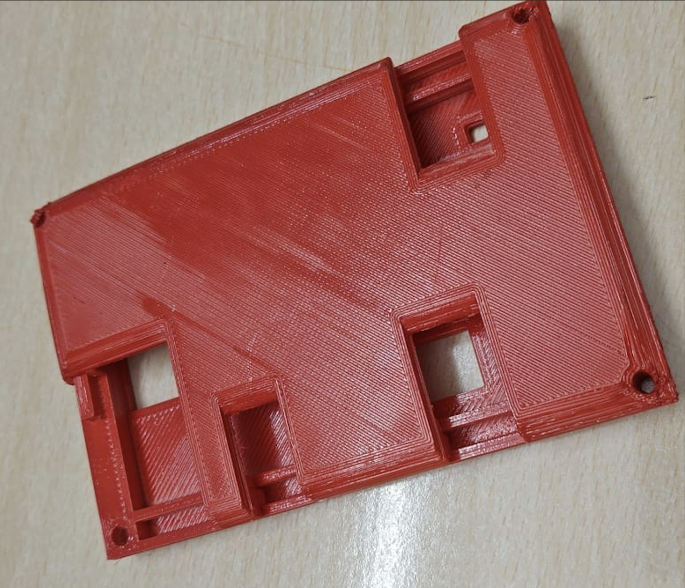
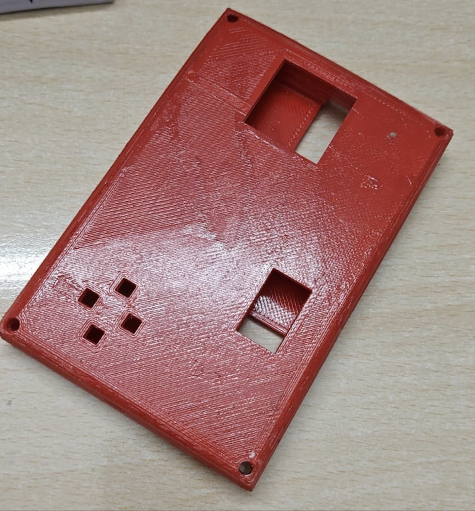

# PRISM: Custom Handheld Gaming Console

*A custom-built handheld gaming console with 3D-capable GPU and gyroscopic control*

## Overview

Prism is a handheld gaming console featuring a custom 3D-capable GPU implemented on a Zynq SoC FPGA, complete with fixed-function graphics pipeline and gyroscopic motion control. Designed by Y𝜄𝜋10𝜕 Labs as part of ESDP Lab at IIT Hyderabad.

## Technical Specifications

### Display
- **Resolution**: During development timeline, we plan on testing with the following resolutions
  - Mid-Spec: 400 × 240 @ 60fps
  - Low-Spec: 200 × 120 @ 30fps
- **Screen Size**: 5-inch LCD Panel @ 60Hz
- **Pixel Density**: 151 PPI
- **Color Support**: 15-bit RGB (32,768 colors)

### Controls
- **Gyroscopic Motion**: 6-axis IMU sensor (LSM6DSL)
- **Analog Joystick**: Full 360° with variable pressure
- **D-Pad**: 4-button pad

### Hardware Architecture
- **SoC**: Xilinx Zynq-7000 Series
- **Memory**: 256 MB DDR3 SDRAM
- **Storage**: 2 x SD Card / ROM
- **Graphics**: Custom GPU pipeline implemented in FPGA and ARM core
  - Vertex Shader
  - Shape Assembly
  - Rasterization
  - Pixel Shader
- **Custom Audio Engine**: 
  - Capable of handling upto 255 Channels, each with primitive DSP effects, to interface with the game.
  - Supports basic 2D Spatial Audio

## PCB Design

Mentioning [juliancoy](https://github.com/juliancoy/zynqPCB) as his open-source Zynq PCB design helped us a lot as a starting point.

We heavily modified the design, to incorporate out requirements, and the PCB design looks as follows.

## Enclosure

We 3D printed the outer case for the console. The design has space to draw cables out to remaining parts. (It was spray-painted red)

## Software Architecture

### Programming Interface
- C++ for game development (Runs on Petalinux OS)

### Libraries
- **Driver Layer**: Hardware abstraction for:
  - Display output
  - Control inputs
  - Sensors
- **Graphics Layer**:
  - 3D model loading (Loads OBJ only for now)
  - Scene graph management
  - Camera controls

### Game Development Tools
  - Optional OpenGL linking to test game on computer. 

## Project Structure

- **Hardware Design**: PCB and schematic files for Zynq FPGA-based board
- **FPGA Development**: Verilog sources for processor core and GPU
- **Drivers**: C++ access layers for hardware components
- **Graphics Library**: GL-compatible rendering system
- **Emulation**: OpenGL-based desktop emulator

**Software is still under progress**

## Development Timeline

The project is supposed to follow the following timeline:
1. **Phase 1**: Architecture design and specifications freeze
2. **Phase 2**: Low-spec implementation (200 × 120 @ 60fps)
3. **Phase 3**: Mid-spec implementation (400 × 240 @ 60fps)
4. **Phase 4**: PCB design/fabrication and hardware assembly
5. **Phase 5**: Game development and testing

Of course, as with any project, the timeline was only a mere suggestion for what was to happen. We technically hit goals for finishing the PCB, and then waited after that to do everything else.

## Team

Y𝜄𝜋10𝜕 Labs:
- Adarsh A (EE23BTECH11203)
- Manohar K (EE23BTECH11208)
- Prajwal M (EE23BTECH11217)
- Mihir Divyansh Eachempati (EE23BTECH11017)
- Soham Prabhakar More (EE23BTECH11223)
- Sri Krishna Prabhas Yadla (EE23BTECH11224)
